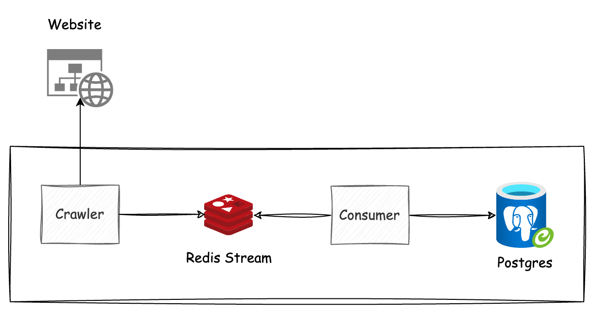
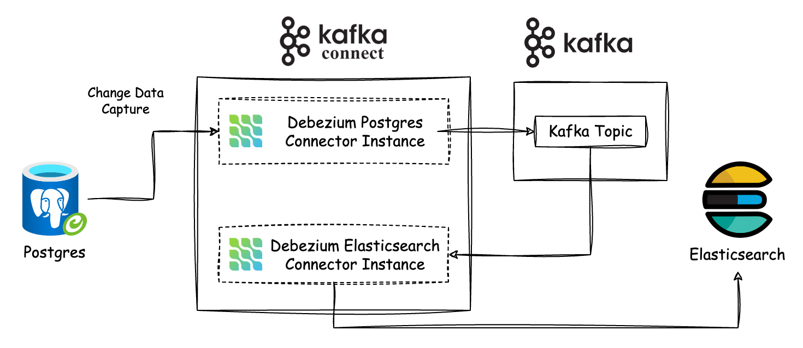

# Crawler Demo for 200LAB DevOps Course

In this course, we will set up the CI/CD and infrastructure for the crawler systems below on Kubernetes.

## Overview System

Crawler System: crawler posts + redis stream + consumer

Change Data Capture System: Postgres + Kafka Connect + Elasticsearch

API Service: Rust + Postgres + Elasticsearch

